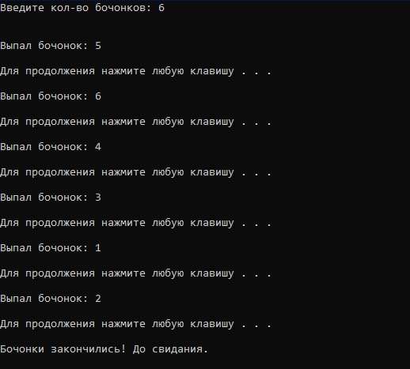

# # Bochonli
### О программе
программа производит жеребьевку, согласно кол-ву введенных бочонков, когда бочонки заканчиваются - выводится соответствующее сообшение
***
### О работе с программой
после запуска программы пользователь вводит кол-во бочонков, затем программа рандомно выбирает бочонок и выводит его, когда бочонки заканчиваются - выводится соответствующее сообшение
***
### Информация о среде программирования и о запуске кода
среда программирования Visual Studio 2019.
программа скомпилируется в любой среде программирования, поддерживающей c++.
файл в проекте с кодом - 'Bochki.cpp', 'Bochki.txt'
***
### Пример работы программы (Скриншоты)
 - пример работы программы.

